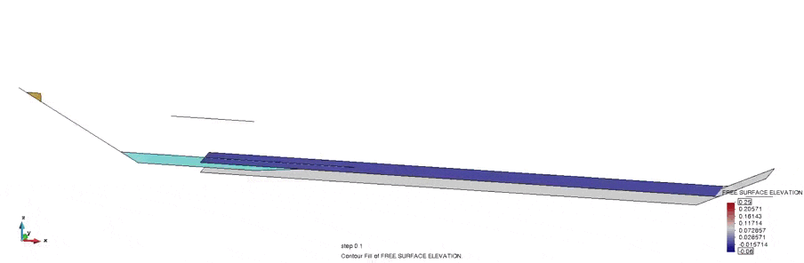

# Merge Simulations

A post processing tool for merging simulations with GiD. From two simulations with dynamic meshes, a third simulation will be generated.

Each source simulation should be stored in a folder, the node and element numbering should be different from one simulation to the other and the time labels should be the shared across the simulations. If you want to merge more simulations, it can be done recursively.

## Usage

1. Download this
2. Type this command in GiD `-np- source /path/to/merge.tcl` and follow the instructions
3. From GiD, click open multiple to read the new files

## Examples

In this example there is a triple combination of post-process results: the PFEM simulation, the free surface mesh and the bottom mesh.

## See also

The background of the above example is explained in [^1] and the implementation can be found [here](https://github.com/KratosMultiphysics/Kratos/blob/master/applications/ShallowWaterApplication/README.md)

[^1]: M. Masó, A. Franci, I. de-Pouplana, A. Cornejo and E. Oñate, A Lagrangian-Eulerian procedure for the coupled solution of the Navier-Stokes and shallow water equations for landslide-generated waves. Advanced Modelling and Simulation in Engineering Sciences, (2022) [10.21203/rs.3.rs-1457837/v1](https://doi.org/10.21203/rs.3.rs-1457837/v1) (in press)
