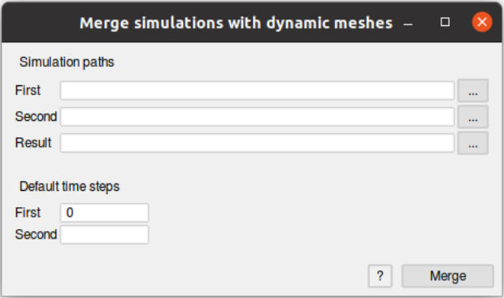

# Merge Simulations

A post processing tool for merging simulations with [GiD](https://www.gidsimulation.com/). From two simulations with dynamic meshes, a third simulation will be generated.

Each source simulation should be stored in a folder. The nodes and elements numbering should be different from one simulation to the other and the time labels should be the shared across the simulations. If you want to merge more simulations, it can be done recursively.

## Usage

1. Download this repository into the `gid-xx/plugins` folder

```shell
cd path/to/gid/plugins
git clone https://github.com/miguelmaso/merge_simulations.git
```
2. Launch GiD and switch to *postprocess*. From the *File* menu, click *Merge simulations...*
3. Fill this form and click *Merge*:

   
4. From the *File* menu, click *open multiple* to read the new files

## Examples

Let consider the following structure:
```
project
├── first_simulation
│   ├── gid_output
│   │   ├── first_simulation_0.post.bin
│   │   ├── first_simulation_0.1.post.bin
│   │   ├── first_simulation_0.2.post.bin
│   │   └── ...
│   └── ...
└── second_simulation
    ├── gid_output
    │   ├── second_simulation_0.post.bin
    │   ├── second_simulation_0.1.post.bin
    │   ├── second_simulation_0.2.post.bin
    │   └── ...
    └── ...
```

Then, a possible configuration could be the next:

- **First path**: first_simulation/gid_output
- **Second path**: second_simulation/gid_output
- **Result path**: merged_simulation

And the resulting simulation would be written to a new folder:
```
project
├── first_simulation
│   └── ...
├── second_simulation
│   └── ...
└── merged_simulation
    ├── merged_simulation_0.post.bin
    ├── merged_simulation_0.1.post.bin
    ├── merged_simulation_0.2.post.bin
    └── ...
```

*What happens if one simulation is longer than the other?* This marco will combine each time step where it is present in both simulations. So, if one simulation takes longer, the extra time steps will be ignored. In this case, it is possible to specify a **Default Time** in order to extend the shorter simulation.

In the animation below, the first simulation (a landslide) has been extended with the initial configuration. Furthermore, there is a triple combination (recursive) of post-process results: the landslide simulation, the free surface simulation and the bottom mesh.


## Known issues

- The extension isn't exported to the user interface and it is restricted to `.post.bin`.
- The use of a *default time* throws warnings related to the duplication of several steps. Moreover, the extended steps contain the mesh information without results.

## See also

The background of the above example is explained in [^1] and the implementation can be found [here](https://github.com/KratosMultiphysics/Kratos/blob/master/applications/ShallowWaterApplication).


[^1]: M. Masó, A. Franci, I. de-Pouplana, A. Cornejo and E. Oñate, A Lagrangian-Eulerian procedure for the coupled solution of the Navier-Stokes and shallow water equations for landslide-generated waves. Advanced Modelling and Simulation in Engineering Sciences, (2022) [10.21203/rs.3.rs-1457837/v1](https://doi.org/10.21203/rs.3.rs-1457837/v1) (in press)
